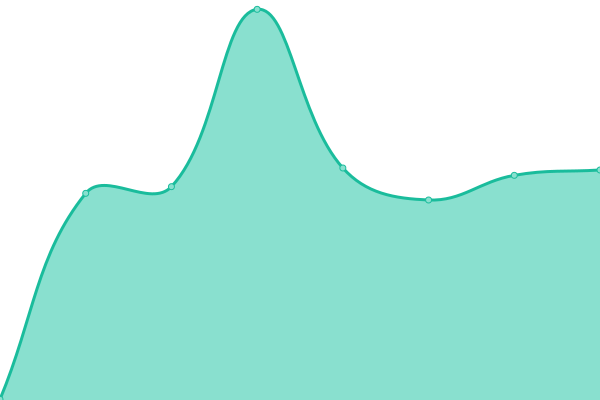

# [📈 Live Status](https://hunger-status.github.io/hunger-status): <!--live status--> **🟩 All systems operational**

This repository contains the open-source uptime monitor and status page for [hunger-status](https://hunger-status.github.io/hunger-status), powered by [Upptime](https://github.com/upptime/upptime).

With [Upptime](https://upptime.js.org), you can get your own unlimited and free uptime monitor and status page, powered entirely by a GitHub repository. We use [Issues](https://github.com/hunger-status/hunger-status/issues) as incident reports, [Actions](https://github.com/hunger-status/hunger-status/actions) as uptime monitors, and [Pages](https://hunger-status.github.io/hunger-status) for the status page.

<!--start: status pages-->
<!-- This summary is generated by Upptime (https://github.com/upptime/upptime) -->
<!-- Do not edit this manually, your changes will be overwritten -->
<!-- prettier-ignore -->
| URL | Status | History | Response Time | Uptime |
| --- | ------ | ------- | ------------- | ------ |
|  [Hunger](https://hunger.ai) | 🟩 Up | [hunger.yml](https://github.com/hunger-status/hunger-status/commits/HEAD/history/hunger.yml) | 

 693ms
     
 | 

<a href="https://hunger-status.github.io/hunger-status/history/hunger">100.00%</a>
    

|  [Hunger Customer](https://hunger.ai/g/index.html) | 🟩 Up | [hunger-customer.yml](https://github.com/hunger-status/hunger-status/commits/HEAD/history/hunger-customer.yml) | 

 293ms
     
 | 

<a href="https://hunger-status.github.io/hunger-status/history/hunger-customer">100.00%</a>
    

|  [Hunger Backend](https://hunger.ai/api/v3/p/sys/time) | 🟩 Up | [hunger-backend.yml](https://github.com/hunger-status/hunger-status/commits/HEAD/history/hunger-backend.yml) | 

 279ms
     
 | 

<a href="https://hunger-status.github.io/hunger-status/history/hunger-backend">100.00%</a>
    

<!--end: status pages-->

[**Visit our status website →**](https://hunger-status.github.io/hunger-status)

## 📄 License

- Powered by: [Upptime](https://github.com/upptime/upptime)
- Code: [MIT](./LICENSE) © [hunger-status](https://hunger-status.github.io/hunger-status)
- Data in the `./history` directory: [Open Database License](https://opendatacommons.org/licenses/odbl/1-0/)
